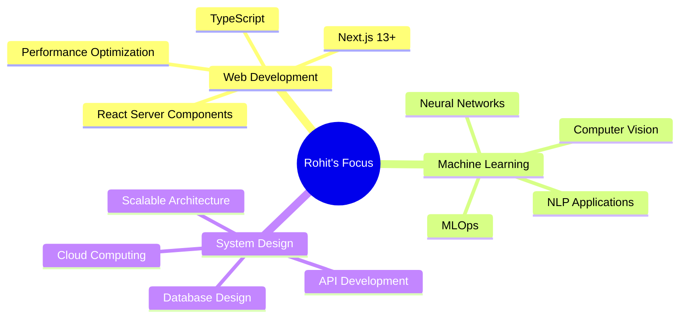

# 👨‍💻 Rohit Singh

<div align="center">
  
  [](https://git.io/typing-svg)
  
</div>

<div align="center">
  
</div>

<div align="right">
  
</div>

## 🌟 About Me

```typescript
const rohit = {
    pronouns: "He/Him",
    location: "India 🇮🇳",
    currentFocus: ["Next.js", "Machine Learning", "System Design"],
    learning: "Advanced React Patterns & AI/ML Engineering",
    askMeAbout: ["Web Development", "Machine Learning", "Problem Solving"],
    technologies: {
        frontEnd: ["React", "Next.js", "TypeScript", "Tailwind CSS"],
        backEnd: ["Node.js", "Express", "Python", "Java"],
        databases: ["MongoDB", "MySQL", "Firebase", "Cassandra"],
        tools: ["Git", "Docker", "Postman", "VS Code"]
    },
    motto: "Code with purpose, innovate with passion! 🚀"
};
```


## 🌐 Connect With Me

<div align="center">
  
[](mailto:rohitsingh692004@gmail.com)
[](https://www.linkedin.com/in/rohit-singh-349020243/)
[](https://instagram.com/rohiiit.fr)
[](https://leetcode.com/u/rohittsingh_/)

</div>


## 🛠️ Technology Arsenal

<div align="center">

### 💻 Programming Languages
[](https://python.org)
[](https://javascript.com)
[](https://typescriptlang.org)
[](https://java.com)
[](https://html.com)
[](https://css.com)

### ⚡ Frameworks & Libraries
[](https://reactjs.org)
[](https://nextjs.org)
[](https://nodejs.org)
[](https://expressjs.com)
[](https://getbootstrap.com)
[](https://tailwindcss.com)

### 🤖 AI/ML & Data Science
[](https://tensorflow.org)
[](https://scikit-learn.org)
[](https://pandas.pydata.org)
[](https://numpy.org)
[](https://d3js.org)

### 🗄️ Databases & Cloud
[](https://mongodb.com)
[](https://mysql.com)
[](https://firebase.google.com)
[](https://cassandra.apache.org)

### 🔧 Development Tools
[](https://git-scm.com)
[](https://github.com)
[](https://code.visualstudio.com)
[](https://postman.com)
[](https://docker.com)

</div>


## 📊 GitHub Analytics & Performance

<div align="center">
  
  
</div>

<div align="center">
  
</div>

<div align="center">
  
</div>


## 🏆 Achievements & Recognition

<div align="center">
  
</div>


## 🎯 Current Focus Areas

<div align="center">
  


</div>

## 📄 Professional Documents

<div align="center">
  
[](https://drive.google.com/file/d/1qNWkGM3mRM-58glOsIg_u2OCkxp85xl8/view?usp=sharing)
[](#)

</div>


## 📈 Visitor Statistics

<div align="center">
  
  
</div>

---

<div align="center">
  
  
  ### 💭 Developer Wisdom
  *"First, solve the problem. Then, write the code."* - **John Johnson**
  
  **⭐ Thanks for visiting! Let's build something amazing together! ⭐**
  
</div>
