# 🚀 Rohit Singh

<div align="center">
  
  [](https://git.io/typing-svg)
  
</div>

<div align="center">
  
</div>

<p align="center">
  
</p>

---

## 🎯 About Me


```python
class RohitSingh:
    def __init__(self):
        self.name = "Rohit Singh"
        self.pronouns = "He/Him"
        self.location = "India 🇮🇳"
        self.experience = {
            "Python": "2+ Years",
            "Web Development": "2+ Years",
            "Machine Learning": "1.5+ Years"
        }
        self.current_focus = [
            "Advanced Python Development",
            "Machine Learning & AI",
            "Full Stack Web Applications",
            "Data Science & Analytics"
        ]
        self.learning_now = [
            "Deep Learning with TensorFlow",
            "FastAPI & Django",
            "MLOps & Model Deployment",
            "System Design Patterns"
        ]
    
    def say_hi(self):
        print("Thanks for dropping by! Let's build something amazing together! 🚀")

me = RohitSingh()
me.say_hi()
```

<br clear="right"/>

---

## 🌐 Let's Connect & Collaborate

<div align="center">
  
  [](mailto:rohitsingh692004@gmail.com)
  [](https://www.linkedin.com/in/rohit-singh-349020243/)
  [](https://instagram.com/rohiiit.fr)
  [](https://leetcode.com/u/rohittsingh_/)
  [](#)

</div>

---

## 💼 Professional Arsenal

<div align="center">

### 🐍 Core Python Stack (2+ Years Experience)
[](https://python.org)
[](https://fastapi.tiangolo.com)
[](https://djangoproject.com)
[](https://flask.palletsprojects.com)

### 🤖 AI/ML & Data Science Mastery
[](https://tensorflow.org)
[](https://pytorch.org)
[](https://scikit-learn.org)
[](https://pandas.pydata.org)
[](https://numpy.org)
[](https://matplotlib.org)
[](https://opencv.org)

### 🌐 Frontend & Full Stack
[](https://reactjs.org)
[](https://nextjs.org)
[](https://typescriptlang.org)
[](https://javascript.com)
[](https://tailwindcss.com)

### 🗄️ Databases & Backend
[](https://postgresql.org)
[](https://mongodb.com)
[](https://mysql.com)
[](https://redis.io)
[](https://sqlite.org)

### 🛠️ DevOps & Tools
[](https://docker.com)
[](https://git-scm.com)
[](https://github.com/features/actions)
[](https://postman.com)
[](https://code.visualstudio.com)
[](https://jetbrains.com/pycharm)

</div>

---

## 📊 GitHub Performance & Analytics

<div align="center">
  
  <!-- GitHub Stats from multiple sources -->
  
  
  
</div>

<div align="center">
  
  
</div>

<div align="center">
  
</div>

---

## 🏆 Achievements & Milestones

<div align="center">
  
</div>

---

## 🎯 Current Focus & Learning Journey

```mermaid
mindmap
  root((🚀 Rohit's Tech Journey))
    🐍 Python Mastery
      Advanced Python Patterns
      Async Programming
      Performance Optimization
      Testing & Documentation
    🤖 AI/ML Engineering
      Deep Learning Projects
      Computer Vision
      NLP Applications
      MLOps & Deployment
    🌐 Full Stack Development
      FastAPI Backends
      React/Next.js Frontends
      Database Design
      API Architecture
    📊 Data Science
      Data Analysis & Visualization
      Statistical Modeling
      Big Data Processing
      Business Intelligence
```

<div align="center">



</div>

---

## 🔥 Featured Projects & Contributions

<div align="center">
  
  [](https://github.com/roxhit/your-python-project)
  [](https://github.com/roxhit/your-ml-project)

</div>

---

## 📄 Professional Documents

<div align="center">
  
  [](https://drive.google.com/file/d/1qNWkGM3mRM-58glOsIg_u2OCkxp85xl8/view?usp=sharing)
  [](#)
  [](#)

</div>

---

## 📈 Profile Analytics

<div align="center">
  
  
  
</div>

---

## 🐍 Snake Eating My Contributions

<div align="center">
  
</div>

---

<div align="center">
  
  
  ### 💭 Code Philosophy
  
  > *"The best way to predict the future is to create it with code."*  
  > **- Rohit Singh**
  
  <br>
  
  **🌟 Crafting intelligent solutions with Python for 2+ years and counting! 🌟**
  
  *Feel free to explore my repositories and don't hesitate to reach out for collaborations!*
  
  ---
  
  
  
  
</div>
